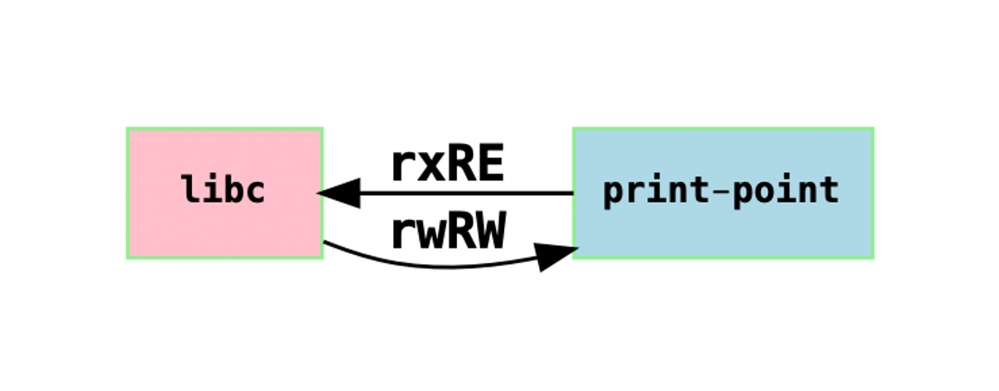
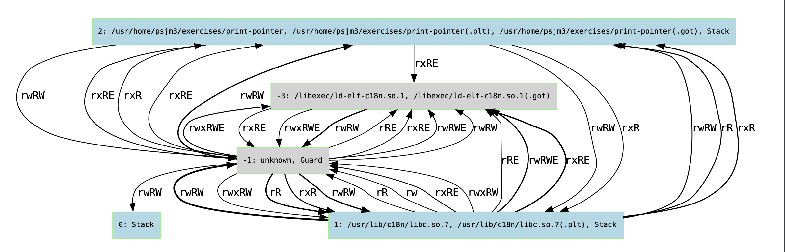

# Chericat Python
A set of python code to display Chericat capabilities related data on graphs

Packages required to run the programs:

|Name|Tested Version|
|---|---|
|Courier Prime|g20180831_1|
|Graphviz|7.1.0_7|
|Python|3.9.17|
|Sqlite3|3.42.0|

The main program to run is "chericat_graphs.py", which can be invoked by running 

```console
$ python3.9 chericat_graphs.py
usage: chericat_graphs [-h] -d D [-g] [-r R] [-c C C] [-l]
chericat_graphs: error: the following arguments are required: -d
```

Without specifying any parameters to chericat_graphs.py it would complain about the missing of the compulsory argument, -d, which is the SQLite database containing the chericat capabilities data for the graphs.

The output graphs are located in the graph-output directory from where you run the python program.

To show all the options available and their brief description, use the --help, -h option:

```console
$ python3.9 chericat_graphs.py --help
usage: chericat_graphs [-h] -d D [-g] [-r R] [-c C C] [-l]

optional arguments:
  -h, --help  show this help message and exit
  -d D        The database to use for the queries
  -g          Generate full capability relationship in mmap graph
  -r R        Executes the SQL query on the provided db
  -c C C      Show capabilities between two loaded libraries <libname 1>
              <libname 2>
  -l          Show compartments graph
```

## Capabilitiy Relationship Overview Graph
The option -g can be used to generate a directed graph showing capabilities "relationship" between the loaded libraries in the target process. Each library further unify the .plt and .got regions.

```console
$ python3.9 chericat_graphs.py -d <db> -g
```

The output is placed in the graph-output directory, the dot output file is called graph_overview.gv, and the graph is generated in pdf format in a file called graph_overview.gv.pdf.

The nodes on the graph represent the libraries (and special regions), for example:

<p align="center">

</p>

and each edge represent capabilities. The direction shows the capabilities located in a library memory region has a pointer address pointing to the libraries where they are directed by the edge arrows.

The thickness represents quantity - the thicker the edge is, the more capabilities were found between the two connected libraries. 

## Capabilites between two specific libraries
Sometimes it’s useful to find out the capabilities ”relationship” between two specific libraries. For example, if the writable and/or executable permissions are not expected on a capability from one library references another one, then we can validate by inspecting the graph produced.

```console
$ python3.9 chericat_graphs.py -d <db> -c <lib1> <lib2>
```

The output is places in the graph-output directory, the dot output file is named <lib1>_vs_<lib2>.gv and the graph output is generated into pdf format named <lib1>_vs_<lib2>.gv.pdf.

<p align="center">

</p>

## Capabilities Relationship Between All Compartments
The option -l can be used to generate a directed graph showing capabilities between the compartments in the target process.

```console
$ python3.9 chericat_graphs.py -d <db> -l
```

The nodes on the graph represent the compartments, each node is labelled using the names of the libraries and special regions within the same compartment (i.e. they all share the same compart id).

The edges represent capabilities. Similar to the -g option above, the direction of the edge shows the reference direction of the capability between the two compartments, and the thickness shows the quantity, the thicker the edge is, the more capabilities were found between the two connected compartments.

<p align="center">

</p>

