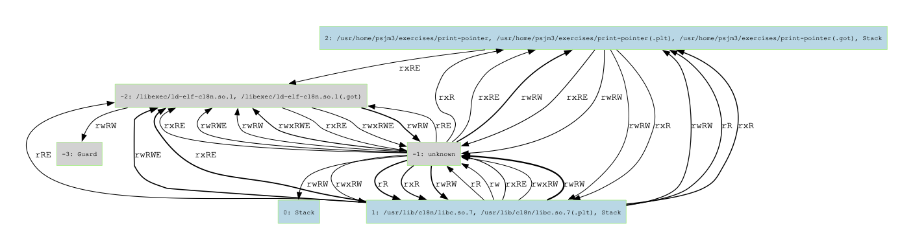

# Chericat Graph Visualisation
A set of python code to display Chericat capabilities related data on graphs

## Pre-requsites to run chericat-python
Packages required and their tested versions to run the programs:

|Name|Tested Version|Command to install on CheriBSD|
|---|---|---|
|Courier Prime|g20180831_1|pkg64 install courier-prime-g20180831_1|
|Graphviz|7.1.0_7|pkg64 install graphviz-7.1.0_7|
|Python|3.9.17|pkg64 install python|
|Sqlite3|3.42.0|This package is installed by default, but if needed, run pkg64 install sqlite3 to install the package|

## Running chericat-python
The main program to run is "chericat_graphs.py". To show all the options available and their brief description, use the --help, -h option:

```console
$ ./chericat_visualise.py --help
usage: chericat_visualise [-h] {libview,compview} ...

options:
  -h, --help          show this help message and exit

Views:
  {libview,compview}  libview or compview
    libview           Sub-commands for library-centric graphs
    compview          Sub-commands for compartment-centric graphs
```

There are two sets of sub-commands, libview and compview:

```console
$ ./chericat_visualise.py libview --help
usage: chericat_visualise libview [-h] -d D [-r R] [-g] [-c C C]

options:
  -h, --help  show this help message and exit
  -d D        The database to use for the queries
  -r R        Executes the SQL query on the provided db
  -g          Generate overview graph showing capability relationships between libraries
  -c C C      Show capabilities between two loaded libraries <libname 1> <libname 2>

$ ./chericat_visualise.py compview --help
usage: chericat_visualise compview [-h] -d D [-r R] [-g] [-g_no_perms] [-c C C]

options:
  -h, --help   show this help message and exit
  -d D         The database to use for the queries
  -r R         Executes the SQL query on the provided db
  -g           Generate overview graph showing capability relationships between compartments
  -g_no_perms  Generate overview graph showing capability relationships (but don't show permissions) between compartments
  -c C C       Show capabilities between two compartments <compname 1> <compname 2>
```

The output graphs are written to the `graph-output` sub-directory in the current directory.

## Capabilitiy Relationship Overview Graph
The option -g can be used to generate a directed graph showing capabilities "relationship" between the loaded libraries or compartments in the target process. Each library further unify the .plt and .got regions.

To generate the overview graph in library-centric view:

```console
$ ./chericat_visualise.py libview -d <db> -g
```

The output is placed in the `graph-output` sub-directory, the dot output file is called <db>.libview_full_graph.gv, and the graph is generated in pdf format in a file called <db>.libview_full_graph.gv.pdf.

The nodes on the graph represent the libraries (and special regions), for example:

<p align="center">

</p>

and each edge represent capabilities. The direction shows the capabilities located in a library memory region has a pointer address pointing to the libraries where they are directed by the edge arrows.

The thickness represents quantity - the thicker the edge is, the more capabilities were found between the two connected libraries. 

Here is an example full graph generated from a simple program:

<p align="center">

</p>

Similarly, to generate the overview graph in compartment-centric view:

```console
$ ./chericat_visualise.py compview -d <db> -g
```

The output is written to the `graph-output` sub-directory, the dot output file is called <db>.compart_full_graph.gv, and the graph is generated in pdf format in a file called <db>.compart_full_graph.gv.pdf.

The nodes on the graph represent the named compartments, and each edge represent capabilities between the compartments. Similar to the libview graph, the thickness of the edges represents quantity.

Here is an example of what a compartment-centric overview graph looks like:

<p align="center">

</p>

## Capabilites between two specific libraries
Sometimes it is useful to find out the capabilities ”relationship” between two specific libraries or compartments. For example, if the writable and/or executable permissions are not expected on a capability from one library or compartment references another one, then we can validate by inspecting the boundaries on the graph produced.

For libview:

```console
$ ./chericat_visualise.py libview -d <db> -c <lib1> <lib2>
```

The output is written to the `graph-output` sub-directory, the dot output file is named <db>.libview_<lib1>_vs_<lib2>.gv and the graph output is generated into pdf format named <db>.libview_<lib1>_vs_<lib2>.gv.pdf.

<p align="center">

</p>

Similarly, for compview:

```console
$ ./chericat_visualise.py compview -d <db> -c <compname 1> <compname 2>
```

The output is written to the `graph-output` sub-directory, the dot output file is named <db>.compview_<comp1>_vs_<comp2>.gv and the graph output is generated into pdf format named <db>.compview_<lib1>_vs_<lib2>.gv.pdf.

<p align="center">

</p>

## Simplified graph for compartment-centric overview graph
The example above shows an easy to read graph in compview for a simple program, but it is not uncommon for a program to have over a hundred libraries or compartments and therefore the graph can get messy and difficult to read. One way to simplify the graph is to remove the distinguish between capabilities with different permissions, and simply have an edge between a capability location and the referenced location if there is at least one capability found.

Command to generate this graph:

```console
$ ./chericat_visualise.py compview -d <db> -g_no_perms
```

The generated dot file is named <db>.compart_no_perms.gv and the pdf output is named <db>.compart_no_perms.gv.pdf, both are also placed in the `graph-output` sub-directory from where you run the Python code.

Here is an example output using the same simple program as above, but without permissions details on the edges:

<p align="center">

</p>

